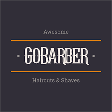

## Sumário
- [1. 🚀️ O projeto](#1-️-o-projeto)
- [2. 👁️ Prévia da Aplicação](#2-️-prévia-da-aplicação)
- [3. 💻️ Tecnologias Usadas](#3-️-tecnologias-usadas)
- [4. 🤔 Como contribuir](#4--como-contribuir)
  

# 1. 🚀️ O projeto
Aplicação para agendar e gerenciar serviços de beleza, onde prestadores de serviços podem se cadastrar, e usuários poderão marcar agendamentos com estes provedores.

# 2. 👁️ Prévia da Aplicação

 

# 3. 💻️ Tecnologias Usadas

O projeto foi feito com as seguintes tecnologias:

- [NodeJS](https://nodejs.org/en/)
- [ReactJS](https://pt-br.reactjs.org/)
- [ExpressJS](https://expressjs.com/pt-br/)
- [JWT](https://jwt.io/)
- [Yup](https://github.com/jquense/yup)
- [Styled-Components](https://styled-components.com/)
{...}

# 4. 🤔 Como contribuir

- Faça um fork desse repositório;
- Cria uma branch com a sua feature:  `git checkout -b minha-feature`;
- Faça commit das suas alterações:  `git commit -m 'feat: Minha nova feature'`;
- Faça push para a sua branch:  `git push origin minha-feature`.

Depois que o merge da sua pull request for feito, você pode deletar a sua branch.

Feito com 💜 por <a href="https://www.linkedin.com/in/hantonny-korrea-2853911a0/"><b>Hantonny Korrea</b></a>

