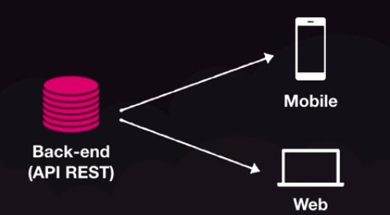
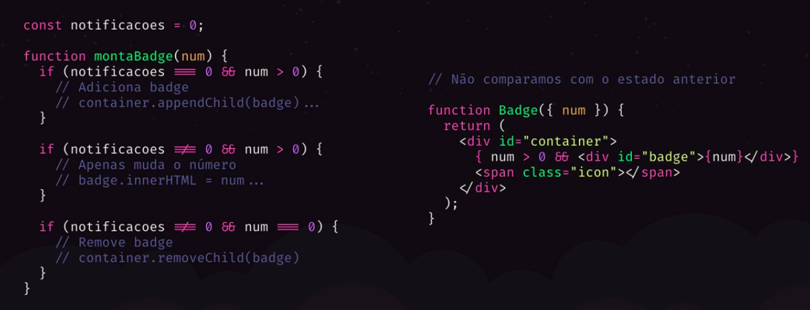
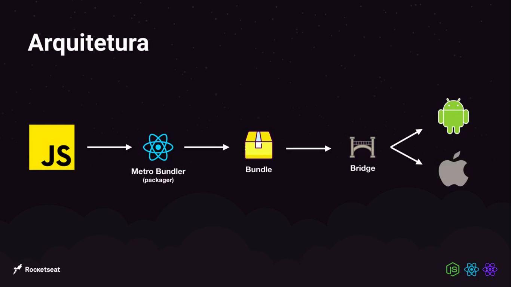
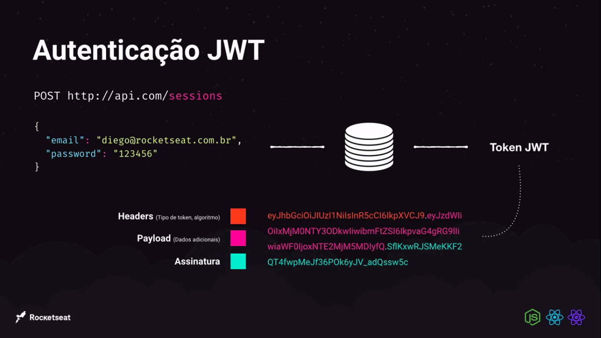

# 💻 Anotações do GoStack

<p align="center">
  
</p>

## Sumário

- [1. Back-end com NodeJS](#1-back-end-com-nodejs)
- [2. Front-end com ReactJS](#2-front-end-com-reactjs)
- [3. Mobile com React Native](#3-mobile-com-react-native)
- [4. Typescript](#4-typescript)
- [5. Primeiro projeto NodeJS](#5-primeiro-projeto-nodejs)
- [6. Iniciando back-end do app](#6-iniciando-back-end-do-app)
  - [6.1. Banco de Dados](#61-banco-de-dados)
  - [6.2. Cadastro de Usuários](#62-cadastro-de-usuários)
  - [6.3. Autenticação](#63-autenticação)
  - [6.4. Upload de imagens](#64-upload-de-imagens)
  - [6.5. Tratando exceções](#65-tratando-exceções)

# 1. Back-end com NodeJS
## Métodos HTTP

- GET: Buscar informações do back-end;
- POST: Criar uma informação no back-end;
- PUT/PATCH: Alterar informação no back-end;
    - PUT: Alterar todas as informações no back-end;
    - PATCH: Alterar uma informação especifica no back-end;
- DELETE: Deletar uma informação no back-end;

## Tipos de parâmetros

- Query Params: Filtros e paginação
- Route Params: Identificação de recursos (Atualizar/Deletar)
- Request Body: Conteúdo na hora de criar ou editar um recurso (Formato JSON que é utilizado)

## Middleware

### Interceptador de requisição que pode interromper totalmente a requisição ou alterar dados da requisição
```jsx
function validateProjectId(request,response, next) {
    const {id} = request.params;

    if(!isUuid(id)){
        return response.status(400).json({error: 'Invalid project ID.'})
    }

    return next();
}
app.use('/projects/:id', validateProjectId)

app.put('/projects/:id', (request,response) => {
    const {id} = request.params;
    const {title, owner} = request.body;

    const projectIndex = projects.findIndex(project => project.id === id);

    if(projectIndex < 0){
        return response.status(400).json({error: 'Project not found'})
    }

    const project = {
        id,
        title,
        owner,
    }

    projects[projectIndex] = project

    return response.json(project);
})
```
# 2. Front-end com ReactJS
## O que é React?

- Biblioteca para construção de interfaces
- Utilizando para construção de Single-Page-Applications
- Podemos chamar de framework
- Tudo fica dentro do Javascript
- React: é biblioteca
- ReactJS: é o comportamento no browser junto com ReactDOM
- React Native: React + Biblioteca de elementos nativos

## Vantagens

- Organização do código
    - Componentização
- Divisão de responsabilidade
    - Back-end: Regra de negócio
    - Front-end: Interface
- Uma API, múltiplos clientes

<p align="center">
  
</p>

- Programação declarativa
## JSX (Javascript XML)

- Escrever HTML dentro do Javascript
- Com React podemos criar nosso próprios elementos

## Imperativo versus Declarativo

<p align="center">
  
</p>

## Babel /  Webpack

- O browser não entende todo o código
- O Babel converte o código JS de uma forma que o browser entenda
- O Webpack possui várias funções
    - Criação do bundle, arquivo com todo código da aplicação
    - Ensinar ao Javascript como importar arquivos CSS, imagens e etc
    - Live reload com Webpack Dev Server

## Fragmentos / Fragments

Um padrão comum no React é que um componente pode retornar múltiplos elementos. Os Fragmentos permitem agrupar uma lista de filhos sem adicionar nós extras ao DOM.

## Sintaxe curta

Há uma sintaxe nova e mais curta que você pode usar para declarar fragmentos. Parecem tags vazias:

```jsx
import React from 'react';
import Header from './components/Header'

function App(){
    return (
		/*Fragments*/
    <>
        <Header title="Homepage">
            <ul>
                <li>Homepage</li>
                <li>Projects</li>
            </ul>
        </Header>
        <Header title="Projects">
            <ul>
                <li>Homepage</li>
                <li>Projects</li>
                <li>Login</li>
            </ul>
        </Header>
    </>
		/*Fragments*/
    )
}

export default App;
```

## Conceito de Propriedades - Passando propriedades para os componentes

### Children é propriedades passadas no conteúdo do componente

```jsx
import React from 'react';

export default function Header({title, children}) {
    return (
        <header>
            <h1>{title}</h1>
            {children}
        </header>
    )
}
```

```jsx
import React from 'react';
import Header from './components/Header'

function App(){
    return (
    <>
        <Header title="Homepage">
            <ul>
                <li>Homepage</li>
                <li>Projects</li>
            </ul>
        </Header>
        <Header title="Projects">
            <ul>
                <li>Homepage</li>
                <li>Projects</li>
                <li>Login</li>
            </ul>
        </Header>
    </>
    )
}

export default App;
```
# 3. Mobile com React Native
## O que é React Native?

- Versão do React para desenvolvimento mobile
- Multiplataforma
- Podemos manipular cada plataforma de forma diferente
- Interface nativa
- Código não é transpilado
- Outras plataformas migrando, Microsoft com Windows

## Arquitetura

<p align="center">
  
</p>

## Sintaxe

- A declaração de componentes é igual da web
- Não usamos HTML e sim componentes próprios
- Aplicamos estilo sem classes ou ID
- Todo texto é `<Text/>` não existe estilização própria

## O que é Expo? Vamos usar?

- SDK com um conjunto de funcionalidades para usar (câmera, vídeo, integrações)
- Não é necessários configurar emulador

## Por que não vamos utilizar?

- Limitação sobre o controle do código nativo
- Várias bibliotecas não tem suporte para o Expo
- O Expo liberou seu conjunto de ferramentas prontas para serem utilizadas com projetos que não utilizam Expo

## Características do React Native

- Não possuem valor semântico (significado)
- Não possuem estilização própria
- Todos componentes tem display flex como padrão
- View: qualquer tipo de contêiner - div, footer, header, main, aside, section
- Text: qualquer tipo de texto - p, span, strong, h1, h2, h3

## Rodar o aplicativo no celular

- Terminal 1

```jsx
npm start
```

- Terminal 2

```jsx
yarn android
```
# 4. Typescript
## Mitos do Typescript

- Typescript diminui a produtividade
- Typescript é transformar Javascript em Java ou C#
- O mercado não usa Typescript
- Typescript substitui o Javascript por completo
- Typescript atrapalha quem é iniciante

## Guia do Typescript

[Typescript](https://www.notion.so/Typescript-ad7ff34d77c84fc08f6f68d2b3ffce47)

# 5. Primeiro projeto NodeJS
1:

```jsx
yarn init -y
```

2:

```jsx
yarn add express
```
3:

```jsx
yarn add typescript -D
```

4:

```jsx
yarn tsc --init
```
5: No arquivo tsconfig.json vou setar duas propriedades a outDir e rootDir

```jsx
"outDir": "./dist",
"rootDir": "./src",
```

6: Vai converter o código que está na pasta src na pasta dist, ou seja, vai converter o código que está em Typescript para Javascript

```jsx
yarn tsc
```
7: Instalar a declaração de tipos da lib

```jsx
yarn add @types/express -D
```

### O `-D` está instalando como dependência de desenvolvimento

8: Para iniciar o server

```jsx
node dist/server.js
```
9:

```jsx
yarn add ts-node-dev -D
```

10: No arquivo package.json adicionar scripts

```jsx
"scripts": {
    "build": "tsc",
    "dev:server": "ts-node-dev --inspect --transpile-only --ignore-watch node_modules src/server.ts"
}
```
11: Gerar ID automaticamente

```jsx
yarn add uuidv4
```

12: Biblioteca para tratar com Datas e Horários no Javascript

```jsx
yarn add date-fns
```
## Conceitos

DTO - Data Transfer Object

Services

SoC

DRY: Don't repeat Yourself.

### SOLID

Single Responsibility Principle

Dependency Inversion Principle

### Rota

Preocupação da Rota: Receber a requisição, chamar outro arquivo para tratar a requisição e devolver uma resposta.

[Repository, service e patterns](https://www.notion.so/Repository-service-e-patterns-6494ffeeb4d04f6a997d2ed377659a5f)

# 6. Iniciando back-end do app
## 6.1. Banco de Dados
## Object Relational Mapping - ORM

## Docker

Como funciona?

- Criação de ambientes isolados (container)
- Containers expõe portas para comunicação

### Principais conceitos

- Imagem
- Container
- Docker Registry (Docker Hub)
- Dockerfile
    - Receita de uma imagem

## Instalação do Docker

### Linux (Ubuntu/Debian)

No Linux, vamos instalar o Docker utilizando o `apt`, para isso, em seu terminal, execute os comandos abaixo:

```jsx
sudo apt update
sudo apt remove docker docker-engine docker.io
sudo apt install docker.io
```

Agora com o Docker instalado, vamos habilitar para que seu serviço seja iniciado automaticamente com o sistema:

```jsx
sudo systemctl start docker
sudo systemctl enable docker
```

Para garantir que o Docker foi instalado da forma correta, execute no terminal:

```jsx
docker version
```

## Comandos no Docker

### Criar um Container + Uma imagem do Banco de Dados

```jsx
sudo docker run --name gostack-postgres -e POSTGRES_PASSWORD=docker -p 5432:5432 -d postgres
```

Obs.:

- Dar um nome ao container
- Colocar uma senha ao container
- Verificar se a porta está disponível
- Colocar o banco de dados

### Listar Container

```jsx
sudo docker ps
```

### Listar todos os Container

```jsx
sudo docker ps -a
```

### Iniciar o Container

```jsx
sudo docker start ID DO CONTAINER OU NOME
```

### Parar o Container

```jsx
sudo docker stop ID DO CONTAINER OU NOME
```

## Instalação do DBeaver

[DBeaver](https://dbeaver.io/)

## Instalação do TypeORM + PostgreSQL

```jsx
yarn add typeorm pg
```

[TypeORM - Amazing ORM for TypeScript and JavaScript (ES7, ES6, ES5). Supports MySQL, PostgreSQL, MariaDB, SQLite, MS SQL Server, Oracle, WebSQL databases. Works in NodeJS, Browser, Ionic, Cordova and Electron platforms.](https://typeorm.io/#/)

# Migrations

## Versionamento de banco de dados

### No arquivo ormconfig.json deve ser inserido as seguintes linhas de código

```jsx
"migrations": [
    "./src/database/migrations/*.ts"
  ],
  "cli": {
    "migrationsDir": "./src/database/migrations"
  }
```

### No arquivo package.json deve ser inserido as seguintes linhas de código em "scripts"

```jsx
"typeorm": "ts-node-dev ./node_modules/typeorm/cli.js"
```

## Criar uma migrations

```jsx
yarn typeorm migration:create -n NOME DA SUA MIGRATION
```

## Como é as migrations

### No método up é colocado o que deve ser feito no banco de dados, exemplo a criação de uma nova tabela.

### No método down é colocado o que vou desfazer no banco de dados, exemplo excluir uma tabela ou campo dessa tabela.

```jsx
import { MigrationInterface, QueryRunner } from 'typeorm';

export class CreateAppointments1601503152412 implements MigrationInterface {
  public async up(queryRunner: QueryRunner): Promise<void> {}

  public async down(queryRunner: QueryRunner): Promise<void> {}
}
```

## Executar as migrations

```jsx
yarn typeorm migration:run
```

## Observação importante: Só pode alterar uma migrations que não foram enviados para o sistema de controle de versão Exemplo: Git.

## Só pode alter migrations que estão somente na sua maquina.

## Para desfazer uma migrations

```jsx
yarn typeorm migration:revert
```

## Para ver todas as migrations executadas

```jsx
yarn typeorm migration:show
```
## Decorators - Criando model de agendamento

### Usaremos o model **Appointment.ts** criado anteriormente e modificar ele de forma que será usado para representar uma instância da tabela *appointments*.

### Diferente de um model normal, aqui você usará a sintaxe de decorators que servirão para conectar o nosso model ao TypeORM.

## Exemplo:

```jsx
import { Entity, Column, PrimaryGeneratedColumn } from 'typeorm';

@Entity('appointments')
class Appointment {
  @PrimaryGeneratedColumn('uuid')
  id: string;

  @Column()
  provider: string;

  @Column('timestamp with time zone')
  date: Date;
}

export default Appointment;
```
## Dependência reflect-metadata que é utilizada que Typescript utilizar na sintaxe Decorators

```jsx
yarn add reflect-metadata
```
## 6.2. Cadastro de Usuários

### Para desativar a regra CamelCase para todos os arquivos em um projeto, adicione a próxima linha ao arquivo de configuração eslint:

```jsx
rules: {
  ...

  'camelcase': 'off',
}
```
## Alterar Migrations

### Para alterar uma migrations já enviada para o GitHub ou enviada para produção, devemos criar outra migrations para fazer essa alteração.

Exemplo de código que altera uma coluna na migrations

```jsx
import {
  MigrationInterface,
  QueryRunner,
  TableColumn,
  TableForeignKey,
} from 'typeorm';

export default class AlterProviderFieldToProviderId1601679625812
  implements MigrationInterface {
  public async up(queryRunner: QueryRunner): Promise<void> {
    await queryRunner.dropColumn('appointments', 'provider');
    await queryRunner.addColumn(
      'appointments',
      new TableColumn({
        name: 'provider_id',
        type: 'uuid',
        isNullable: true,
      }),
    );
    await queryRunner.createForeignKey(
      'appointments',
      new TableForeignKey({
        name: 'AppointmentProvider',
        columnNames: ['provider_id'],
        referencedColumnNames: ['id'],
        referencedTableName: 'users',
        onDelete: 'SET NULL',
        onUpdate: 'CASCADE',
      }),
    );
  }

  public async down(queryRunner: QueryRunner): Promise<void> {
    await queryRunner.dropForeignKey('appointments', 'AppointmentProvider');

    await queryRunner.dropColumn('appointments', 'provider_id');

    await queryRunner.addColumn(
      'appointments',
      new TableColumn({
        name: 'provider',
        type: 'varchar',
      }),
    );
  }
}
```

**Observação**: O método down deve fazer todo o processo de forma inversa.

## Relacionamento no SQL

- Um para Um (OneToOne) - Um usuário tem um agendamento
- Um para Muitos (OneToMany) - Um usuário tem muitos agendamentos
- Muitos para muitos (ManyToMany) - Muitos usuários participam dos mesmos agendamentos

## Princípio KISS - Keep It Simple and Stupid (Mantenha-o simples e estúpido)

Sempre que possível, a complexidade deve ser evitada, pois a simplicidade garante maiores níveis de aceitação e interação do usuário.

## Conceitos necessários

- Repositories - Repositórios
- Services - Se os únicos métodos utilizados forem os métodos patrões não é necessário criar um repositório.

## Criptografando a senha do Usuário

### Instalando biblioteca para criptografia de senha

```jsx
yarn add bcryptjs
```

### Declaração de Tipos

```jsx
yarn add -D @types/bcryptjs
```
## 6.3. Autenticação
### JWT
<p align="center">
  
</p>

### Para gerar o token na aplicação é necessário fazer a instalação o pacote:

```jsx
yarn add jsonwebtoken
```

### Tipagem do pacote:

```jsx
yarn add @types/jsonwebtoken
```

### Para gerar a chave

[MD5 - Online generator md5 hash](http://www.md5.cz/)

### JWT Debugger

[JWT.IO](https://jwt.io/)

## 6.4. Upload de imagens

### Upload de arquivos

```jsx
yarn add multer
```

### Adicionando a tipagem

```jsx
yarn add -D @types/multer
```
## 6.5. Tratando exceções

### Exception Handling - Tratamento de exceção

### Criar uma pasta errors dentro da pasta src, e criar o arquivo AppError.ts com o seguinte código.

```jsx
class AppError { 
    public readonly message: string

    public readonly statusCode: number

    constructor(message: string, statusCode = 400){
        this.message = message
        this.statusCode = statusCode
    }
}

export default AppError
```
### Depois em todos os services trocar Error por AppError, sendo possível passa o status Code e também trocar no middlewares

```jsx
throw new AppError('Incorrect email/password combination.', 401);
```

### Tratar de forma global os erros com o pacote em funções async / await

```jsx
yarn add express-async-errors
```


---
Feito com 💜 por <a href="https://www.linkedin.com/in/hantonny-korrea-2853911a0/"><b>Hantonny Korrea</b></a>
